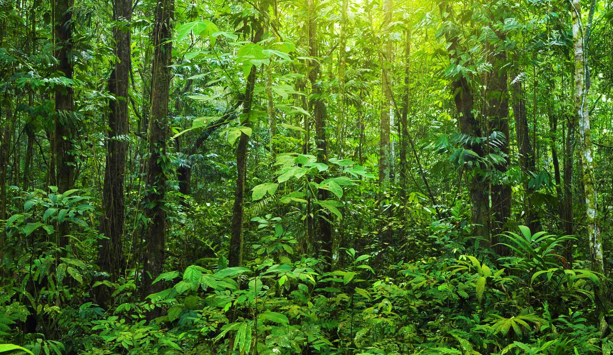

## A Picture - Forests 

 Photo by [Unilever](https://www.unilever.com/news/news-search/2021/how-we-are-protecting-forests-and-those-who-depend-on-them/)

## Background and Objective

Random forests (RF) has shown to be highly applicable and accurate, comparable to state-of-art methods such as bagging, boosting, and support vector machines. However, RF have primarily been used for classification and regression tasks. 

On the other hand, methods that are commonly used for survival data rely on assumptions such as proportional hazards that is often too restrictive.

In this paper, Ishwaran et al. (2008) introduce random survival forests (RSF), an extension of Breiman's RF (2001). RSF incorporates survival information and is designed for analysis of right-censored data. 

## Outline

* Introduction: RF 

* Introduction: RF vs RSF

* (High-Level) Algorithm

  + Ensemble CHF (Cumulative Hazard Function)

  + Ensemble Mortality

  + OOB (out-of-bag) Prediction Error

* Discussion 

* An Example (If Time Allows)

## Introduction: RF 

Random forests (RF) is made up from a collection of trees, and randomness is introduced in the following tree-growing process. 

RF works by 

1. first randomly drawing bootstrap sample of data and using it to grow a tree 

2. and then at each node of the tree, randomly selecting subsets of predictors for splitting. 

The final outcome is based on majority voting (for classification) or averaging (for regression). These features enables RF to approximate rich classes of functions while keeping error low. 

## Introduction: RF vs RSF 

RSF adheres strictly to Breiman's RF (2003). RF is designed such that the tree-growing process takes into account the outcome. Thus, in right-censored survival settings, the splitting rule, the predicted results and the measure of prediction accuracy in RSF must incorporate survival information. 

## (High-Level) Algorithm

Random survival forests involves the following steps: 

1. Randomly draw $B$ bootstrap samples from the original data and grow a survival tree for each bootstrap sample. 

2. At each node of the tree, randomly select $p$ predictors. 

3. Grow the tree to full size under the constraint that a terminal node shoud have no less than $d_0 > 0$ unique deaths. 

4. Calculate CHF (cumulative hazard function) for each tree and average them to obtain the ensemble CHF.

5. Use OOB data to calculate prediction error for the ensemble CHF. 

Note. The number of samples NOT are not drawn are called out-of-bag (OOB) data, which makes up of ~$37$% of the original data. 

## Ensemble CHF (Cumulative Hazard Function)

CHF is 

Ensemble CHF is obtained by averaging over $B$ survival trees. 

## Ensemble Mortality 

Mortality is 

Ensemble mortality is...... 

## OOB (out-of-bag) Prediction Error

## Discussion 

## An Example (If Time Allows)

## Reference

